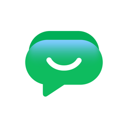
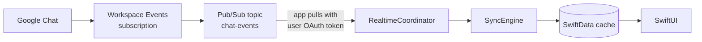

<div align="center">



# Google Chat for macOS

**A native SwiftUI client for Google Chat, built on the official Workspace REST APIs.**


</div>

Google ships no desktop Chat app — only a browser tab and a "install as app" shortcut around it. This is the alternative: a real macOS application that signs in with your own Google account, keeps a local SwiftData cache of your conversations, and receives new messages within about a second over Workspace Events and Cloud Pub/Sub. No Electron, no third-party packages, no backend of your own to run.

It is written for one person's Workspace account and distributed as source. Point it at your own Google Cloud project and it works for yours too.

<br>

## Features

**Reading**

- Sidebar of spaces and DMs, filtered by activity and kind, searchable across every conversation
- Local pin, mute, and a user-ordered pinned group
- Transcript as chat bubbles with day separators, sender grouping, and avatars resolved through the People API
- Chat's own text markup rendered properly — bold, italic, strikethrough, inline code, code blocks, quotes, and bullets
- Threads get their own index, their own unread marks, and an inspector pane
- `cardsV2` messages from Chat apps rendered natively; images open in a zoomable in-app viewer
- Local full-text search over cached history, scoped to one conversation or all of them
- `chat.google.com` links open in the app, not a browser tab — landing on the message, or in its thread

**Writing**

- Send, edit, and delete, with optimistic local echo and rollback on failure
- Reply in a thread, or reply inline to a single message using Chat's native quoted-message metadata
- Reactions, including a full emoji picker, recent-emoji suggestions, and `:shortcode` completion while typing
- `@mention` completion over the space's members — and `@all` — posted as real mentions that notify, not as plain text
- Attachments by file picker, drag-and-drop, or paste

**Around the app**

- Real-time delivery over Workspace Events → Pub/Sub, with automatic subscription renewal and reconciliation on wake
- Notifications for incoming messages that open the right conversation when clicked
- `MenuBarExtra` with a live unread count
- Mark as read, mark as unread — the unread mark is server-side and shows up on chat.google.com too
- Copy a link to any message, in the form the web client's own "Copy link" produces
- Sandboxed and hardened; tokens live in the keychain, never on disk in the clear

<br>

## Architecture

Swift 6 language mode with strict concurrency, no third-party dependencies. Layers run one way only — the UI never touches the network, and sync never touches SwiftUI.

```
┌──────────────────────────────────────────────────────────────┐
│  App          App scene · ChatCommands · MenuBarExtra        │
├──────────────────────────────────────────────────────────────┤
│  Features     Spaces · Messages · Threads · Search · SignIn  │
│               driven by @Observable ChatSessionModel         │
├──────────────────────────────────────────────────────────────┤
│  Store        ChatStore (@ModelActor) · SyncEngine · Schema  │
├───────────────────────────────┬──────────────────────────────┤
│  ChatAPI                      │  Realtime                    │
│  typed REST client + paging   │  Workspace Events + Pub/Sub  │
├───────────────────────────────┴──────────────────────────────┤
│  GoogleAuth   PKCE · Keychain · single-flight token refresh  │
└──────────────────────────────────────────────────────────────┘
```

| Layer | What lives there |
|---|---|
| **GoogleAuth** | OAuth 2.0 authorization code + PKCE through `ASWebAuthenticationSession`. No client secret; the redirect scheme is deliberately *not* registered in `CFBundleURLTypes` so no outside browser can hand a code to the app. Concurrent 401s coalesce into a single refresh. |
| **ChatAPI** | Hand-written typed client over Chat REST v1 — `Codable` DTOs, `AsyncSequence` pagination, central error mapping, jittered backoff honouring `Retry-After`. A `GoogleTransport` value type is shared by Chat, Workspace Events, and Pub/Sub. |
| **Realtime** | One Workspace Events subscription over `spaces/-`, delivering to a Pub/Sub topic the app pulls directly with the user's own token. Renewed on a timer with `ttl: 0`. |
| **Store** | SwiftData with a `VersionedSchema` from the first commit. Writes go through a `@ModelActor`; the UI reads via `@Query`. Messages are keyed by their Chat resource name, which dedupes pagination against events for free. |
| **Sync** | Lazy per-space backfill with cursors, incremental event application, and head reconciliation on wake and network return — events are best-effort and must never be the only source of truth. |

### How a message arrives



There is no websocket and no streaming endpoint in the Chat API — Pub/Sub is the only push mechanism Google offers, which is why it appears in a desktop app's architecture at all. Because the app pulls with the signed-in user's credentials, no service-account key ever touches disk and no server is required.

<br>

## Getting started

### Prerequisites

- macOS **26.5** or later
- Xcode **26.6** or later (Swift 6.3 toolchain)
- A **Google Workspace** account, ideally one where you are an admin

> [!IMPORTANT]
> A personal Gmail account will not work well. The setup below relies on an **Internal** OAuth consent screen, which requires the Cloud project to be parented to a Workspace organisation. Internal is worth the requirement: no verification review, no test-user cap, and refresh tokens that do not expire after seven days.

### 1. Create the Google Cloud project

Create a project inside your organisation, then:

```bash
gcloud config set project YOUR_PROJECT_ID

gcloud services enable \
  chat.googleapis.com \
  workspaceevents.googleapis.com \
  pubsub.googleapis.com \
  people.googleapis.com
```

### 2. Provision Pub/Sub

The topic and subscription names are hard-coded, so use these exactly:

```bash
gcloud pubsub topics create chat-events

gcloud pubsub subscriptions create chat-events-mac \
  --topic=chat-events \
  --ack-deadline=60 \
  --message-retention-duration=24h

# Lets Google Chat publish events into the topic
gcloud pubsub topics add-iam-policy-binding chat-events \
  --member="serviceAccount:chat-api-push@system.gserviceaccount.com" \
  --role="roles/pubsub.publisher"

# Lets the app pull them with your own OAuth token
gcloud pubsub subscriptions add-iam-policy-binding chat-events-mac \
  --member="user:you@your-domain.com" \
  --role="roles/pubsub.subscriber"
```

### 3. Configure OAuth — console only

Neither step has a `gcloud` equivalent.

**Consent screen** ([Google Auth Platform](https://console.cloud.google.com/auth/overview)) — user type **Internal**, then add the scopes listed in [`docs/SETUP.md`](docs/SETUP.md) plus `directory.readonly`.

**Client** ([Clients](https://console.cloud.google.com/auth/clients)) — application type **iOS**, which is also correct for macOS: it issues no client secret and supports the reverse-DNS redirect that `ASWebAuthenticationSession` handles natively. Use your app's bundle identifier.

### 4. Point the app at your project

Edit [`GoogleChatSwiftUI/GoogleAuth/OAuthConfiguration.swift`](GoogleChatSwiftUI/GoogleAuth/OAuthConfiguration.swift):

```swift
static let clientID = "YOUR_NUMBER-YOUR_SUFFIX.apps.googleusercontent.com"
static let redirectScheme = "com.googleusercontent.apps.YOUR_NUMBER-YOUR_SUFFIX"
static let gcpProjectID = "YOUR_PROJECT_ID"
```

Then set `PRODUCT_BUNDLE_IDENTIFIER` in Xcode to the bundle ID you registered with the OAuth client.

> [!NOTE]
> The client ID checked into this repository is intentional, not a leak. Installed-app OAuth clients are issued without a secret precisely because the binary is distributable — security comes from PKCE and the redirect URI being bound to the bundle ID. See [RFC 8252 §8](https://datatracker.ietf.org/doc/html/rfc8252#section-8).

### 5. Build and run

```bash
open GoogleChatSwiftUI.xcodeproj
```

Build and run the `GoogleChatSwiftUI` scheme (⌘R), then sign in. The first launch lists your conversations; history for each one is fetched on first open.

Tests run with ⌘U, or:

```bash
xcodebuild test -scheme GoogleChatSwiftUI -destination 'platform=macOS'
```

<br>

## Keyboard shortcuts

| Shortcut | Action |
|---|---|
| <kbd>⌘R</kbd> | Refresh conversations |
| <kbd>⌘F</kbd> | Search messages |
| <kbd>⌘⇧K</kbd> | Search conversations — <kbd>↑</kbd><kbd>↓</kbd> walk results without opening them, <kbd>↩</kbd> opens |
| <kbd>⌘⇧T</kbd> | Show threads |
| <kbd>⌘⇧A</kbd> | Mark all as read |
| <kbd>⌘⇧U</kbd> | Mark the open conversation unread |
| <kbd>↩</kbd> / <kbd>⇧↩</kbd> | Send / insert a line break |
| <kbd>⌘↩</kbd> | Send from anywhere in the composer |
| <kbd>⌘+</kbd> <kbd>⌘-</kbd> <kbd>⌘0</kbd> | Zoom in the image viewer |

<br>

## What the Chat API cannot do

Some absences are permanent, and the design works around them rather than faking them:

| Missing | Consequence |
|---|---|
| Typing indicators | Not exposed at any auth level. Cannot be replicated. |
| Others' presence | `users.availability` reads only the calling user's state. |
| Read receipts | Read state is self-only. |
| Message search | No endpoint exists, so search is local over cached history — and the UI says so. |
| Display names and avatars | Chat never populates `displayName`. Every name and photo comes from the People API. |
| Pin, star, favourite | Nothing of the sort exists in the v1 discovery document, so pinning is local and invisible to chat.google.com. |
| Reliable mute state | `spaceNotificationSetting` disagrees with what the web client shows, so mute is local too. |
| Formatted message bodies | `*bold*`, `` `code` ``, and the rest arrive literally in `text`. `ChatTextRenderer` parses them, with word-edge rules pinned by tests so `snake_case` and URL paths survive intact. |
| Interactive cards | `onClick.action` calls back into the app that *sent* the card, so link buttons work and action widgets render disabled. |

[`docs/PLAN.md §9`](docs/PLAN.md) records the full list — each entry cost a wrong assumption first.

<br>

## Project layout

```
GoogleChatSwiftUI/
├── GoogleAuth/     OAuth + PKCE, keychain storage, token refresh
├── ChatAPI/        Typed Chat REST v1 client, DTOs, transport, directory lookup
├── Realtime/       Workspace Events subscription, Pub/Sub pull, event decoding
├── Store/          SwiftData schema, ChatStore actor, SyncEngine
└── Features/
    ├── Spaces/     Sidebar, filters, search field, session model
    ├── Messages/   Transcript, bubbles, composer, threads, emoji, cards
    ├── Search/     Local message search
    ├── SignIn/     Sign-in screen
    └── Shared/     Commands, notifications, menu bar, avatars

GoogleChatSwiftUITests/   134 Swift Testing cases over rendering, unread
                          bookkeeping, scrolling, reply rules, mentions, and links
docs/
├── PLAN.md         Architecture, delivery phases, API findings
└── SETUP.md        Google Cloud project state and remaining console steps
```

<br>

## Gotcha worth knowing before you edit

`SWIFT_DEFAULT_ACTOR_ISOLATION = MainActor` makes **every** unannotated type, extension, and closure main-actor isolated. Any `Codable` DTO, protocol conformance, or callback used off the main actor needs an explicit `nonisolated`.

> [!WARNING]
> This only sometimes produces a compile error. `async` calls cross actors silently, so the usual symptom is JSON decoding quietly running on the main thread rather than a diagnostic.

<br>

## Disclaimer

This is an unofficial, independent project. It is not affiliated with, authorised, endorsed, or sponsored by Google LLC in any way. It is a third-party client that talks to the public Google Workspace REST APIs with your own credentials.

"Google", "Google Chat", and "Google Workspace" are trademarks of Google LLC, used here only to describe what the app connects to.

